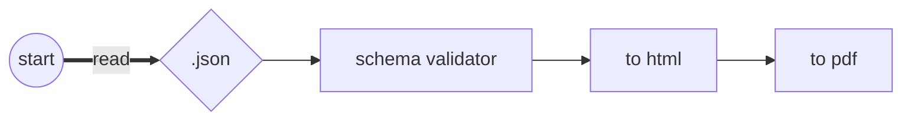

# resume

Generate localized resumes using the same layout.

## Prerequisite

Node.js LTS

## Generate a resume

After installing node dependencies, type:

```
npm run build
npm start
```

The flow to generate is simple. Once you add a language data inside [data/](https://github.com/Leyka/resume/tree/main/data) directory (e.g. `en.json`), this is what happen:



Internally, the generator leverages [Nunjucks](https://mozilla.github.io/nunjucks/), a templating language, to create HTML content from templates.

This HTML content is then fed into [Puppeteer](https://pptr.dev/), a Node library which provides a high-level API to control headless Chrome or Chromium browsers.

Puppeteer, acting as a headless browser, utilizes the Chromium API to convert the HTML content into a PDF file.

## Example

The process can be summarized as: `json` + `njk` = `pdf`

### Input: `.json`

Sample English resume data can be found at: [data/en.json](./data/en.json)

To ensure the JSON schema remains valid for different languages, I use the [Joi](https://joi.dev/) library for validation.

### Input: `.njk`

The Nunjucks template and the CSS file are located here: [src/template](./src/template/)

Note: [Tailwind CSS](https://tailwindcss.com/) is a personal preference and can be replaced as needed.

### Output: `.pdf`

You can view an example of the generated PDF here: [resumes/en.pdf](https://github.com/Leyka/resume/blob/main/resumes/en.pdf)

## Customize Your Resume

It's possible to work on the resume layout directly on the browser.

Type on terminal:

```
npm run server
```

This command initiates a web server at `http://localhost:3000`.

To target a specific language, append `/<lang>` to the URL.

For example, to view the French resume (if available), navigate to `http://localhost:3000/fr`.

## License

MIT
