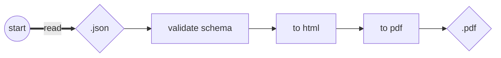

# resume

Generate localized resume with the same layout.

## Generate a resume

After installing node dependencies, type:

```
npm start
```

The flow to generate is very simple. Once you add a language data inside [data/](https://github.com/Leyka/resume/tree/main/data) directory (e.g. `en.json`), this is what happen:

Behind the scenes, it uses [Puppeteer](https://pptr.dev/) library to start a headless browser, read the html and save the pdf. 

### Example

Example of generated PDF: [en.pdf](https://github.com/Leyka/resume/blob/main/resumes/en.pdf)

## Work on your resume

It's possible to work on the resume layout easily on the browser. type on terminal:

```
npm start server
```

This will launch a web server on `http://localhost:3000`.

You can also target a specific language by adding `/<lang>`. 

Example: `http://localhost:3000/fr`

## License 

MIT

