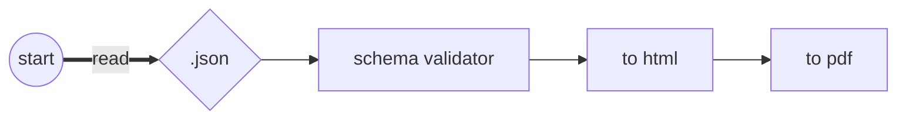

# resume

Generate localized resumes using the same layout.

## Prerequisites

- Node.js (LTS)

## Generate a resume

Install dependencies

```
npm install
```

Then run the generator by doing:

```
npm run build
npm start
```

The process can be summarized as: `json` + `html` = `pdf`.

Once you add a language data inside [data/](https://github.com/Leyka/resume/tree/main/data) directory (e.g. `en.json`), this is what happen:



Internally, the generator leverages [Nunjucks](https://mozilla.github.io/nunjucks/), to create HTML content from templates.

This HTML content is then fed into [Puppeteer](https://pptr.dev/) that utilizes the Chromium API to convert the HTML content into a PDF file.

## Customize Your Resume

It's possible to work on the resume layout directly on the browser.

Type on terminal:

```
npm run server
```

This command initiates a web server at `http://localhost:3000`.

To target a specific language, append `/<lang>` to the URL.

For example, to view the French resume (if available), navigate to `http://localhost:3000/fr`.

_Note that `<lang>` is basically the file name in `data` folder (`/potato` => `potato.json`)_

## Example

### Input: `.json`

Sample English resume data can be found at: [data/en.json](./data/en.json)

To ensure the JSON schema remains valid for all languages, [Joi](https://joi.dev/) is used as JSON schema validator.

### Input: `.njk` (html)

The Nunjucks template and the CSS file are located here: [src/template](./src/template/)

Note: [Tailwind CSS](https://tailwindcss.com/) is a personal preference and can be replaced as needed.

### Output: `.pdf`

Generated PDF here: [resumes/en.pdf](https://github.com/Leyka/resume/blob/main/resumes/en.pdf)

### Preview


## License

MIT
